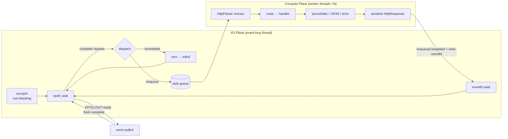
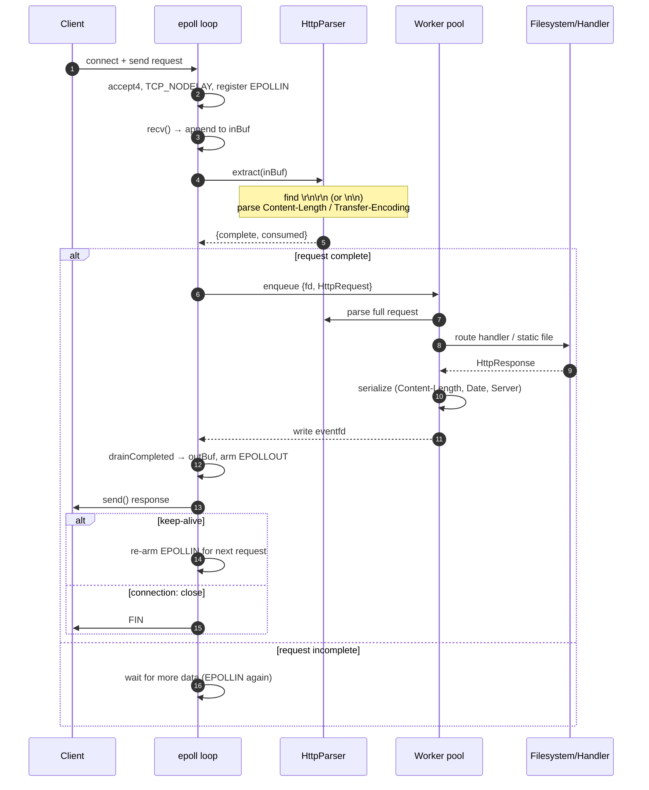
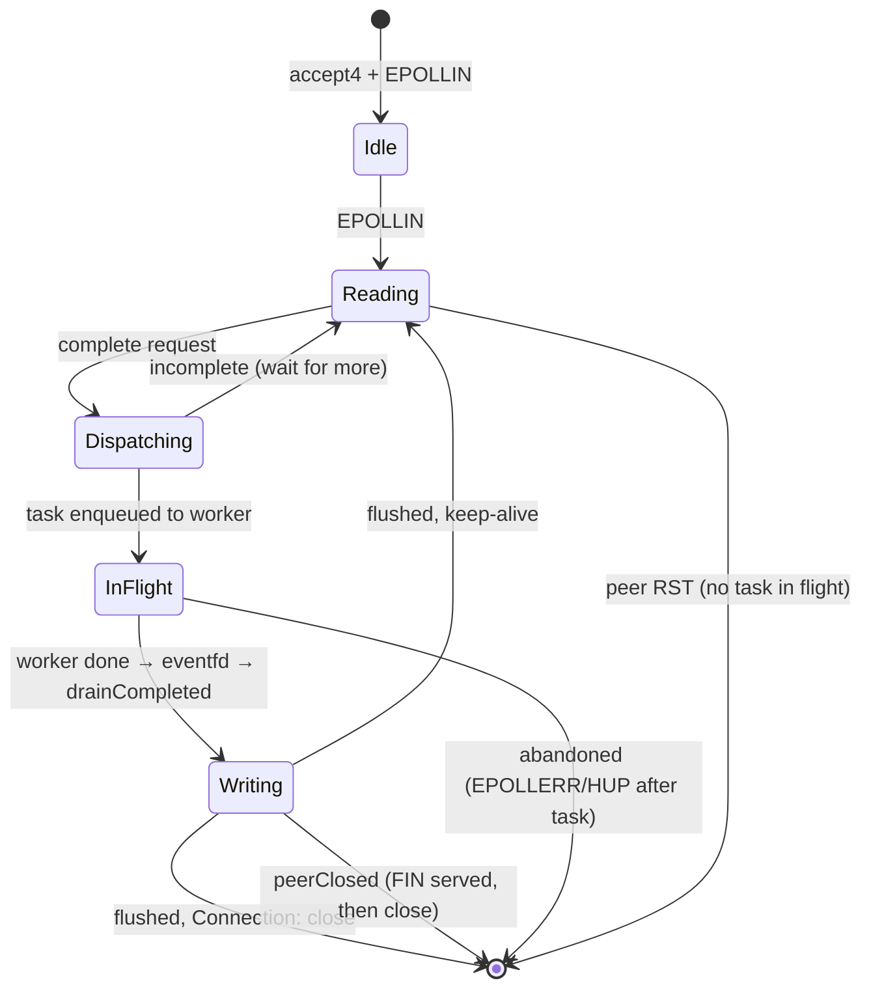
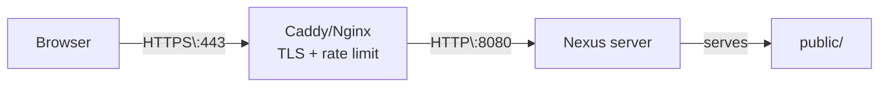

# ⚡ Nexus HTTP Server

> A dependency-free, event-driven **HTTP/1.1 web server in C++20**, built directly on Linux kernel primitives: `epoll`, `eventfd`, and non-blocking POSIX sockets. No libraries. No abstractions. Just syscalls.

```
┌────────────────────────────────────────────────────────────────────┐
│                         NEXUS C++ ENGINE                          │
│            Linux epoll · POSIX sockets · C++20 · zero deps        │
└────────────────────────────────────────────────────────────────────┘
```

---

## 📑 Table of Contents

- [Features](#features)
- [Architecture](#architecture)
- [Request Lifecycle](#request-lifecycle)
- [Connection State Machine](#connection-state-machine)
- [Build](#build)
- [Run](#run)
- [API Reference](#api-reference)
- [HTTP Semantics](#http-semantics)
- [Configuration](#configuration)
- [Security](#security)
- [Performance](#performance)
- [Deployment](#deployment)
- [Project Layout](#project-layout)
- [Future Work](#future-work)

---

## ✨ Features

| Area | Detail |
| --- | --- |
| **Event loop** | Single-threaded `epoll` (level-triggered) over `accept4` + per-connection sockets |
| **Concurrency** | Bounded worker pool (default 4) for parse → route → static file I/O |
| **Wakeup channel** | `eventfd` handoff for completed responses (no fd state touched off-loop) |
| **Keep-alive** | HTTP/1.1 persistent connections with explicit `Connection:` header |
| **Pipelining** | Multiple buffered requests on one connection, processed sequentially |
| **Incremental parser** | Scans headers for length first; no body copy until complete |
| **Static files** | MIME-type aware, path-traversal safe, HEAD-aware |
| **Signals** | Async-safe `SIGINT`/`SIGTERM` shutdown via `eventfd` wakeup |

---

## 🏗 Architecture

Nexus splits work into two planes — a **single-threaded I/O plane** that multiplexes sockets, and a **bounded compute plane** that does the CPU/disk work — the same design as Nginx and libuv-style event servers.



### Control flow at a glance

```
 Client │  Event loop (1 thread)          │  Workers (N threads)
────────┼─────────────────────────────────┼────────────────────────
   SYN   │                                │
  ──────►│ accept4() → epoll ADD          │
   req   │                                │
  ──────►│ recv() until "\r\n\r\n"        │
         │ extract() → headers complete?  │
         │   ── no ──► keep reading       │
         │   ── yes ─► enqueue {fd, req}  │
         │                                │ parse → route → read file
         │                 ◄───────────── │ serialize response
         │ eventfd ◄─── write(1)          │
   resp  │                                │
  ◄──────│ EPOLLOUT → send() outBuf       │
         │ flush → re-arm EPOLLIN         │  (keep-alive)
```

---

## 🔄 Request Lifecycle



---

## 🧩 Connection State Machine

Every file descriptor carries a small state struct (`include/Connection.hpp`):



| Field | Purpose |
| --- | --- |
| `inBuf` | Accumulated unparsed bytes from `recv()` |
| `outBuf` / `outOffset` | Serialized response pending `send()` |
| `keepAlive` | Whether to re-arm `EPOLLIN` after flush |
| `taskInFlight` | Guards against dispatching >1 request per connection |
| `peerClosed` | FIN received; deliver response, then close |
| `abandoned` | Peer unreachable mid-flight; drop fd at `drainCompleted` |

> **Why this matters:** the fd is *never* closed while a task is in flight. A worker completing just as a peer RSTs could otherwise have its response delivered to a **re-used fd** belonging to a brand-new connection. The `abandoned` state defers the `close()` until the worker's response has been drained.

---

## 🛠 Build

Requires **Linux**, a C++20 compiler (GCC ≥ 11 / Clang ≥ 14), and `make` or CMake ≥ 3.16.

```bash
# Makefile
make              # → ./nexus-server

# or CMake
cmake -B build -S .
cmake --build build -j
```

Zero external dependencies — only the C++ standard library and kernel headers.

---

## ▶️ Run

```bash
./nexus-server [port]     # port defaults to 8080
```

| Signal | Behavior |
| --- | --- |
| `SIGINT` / `SIGTERM` | Async-safe wakeup via `eventfd` → drain workers → close all fds → exit 0 |

---

## 📡 API Reference

| Endpoint | Method | Description |
| --- | --- | --- |
| `/` | `GET` / `HEAD` | Static dashboard (HTML/JS/CSS) |
| `/api/status` | `GET` | Health, uptime, worker count |
| `/api/greet?name=<x>` | `GET` | JSON greeting with escaped query param |
| `/api/echo` | `POST` | Returns the request body |

### Examples

```bash
# Health check
curl localhost:8080/api/status
```

```json
{
  "status": "healthy",
  "uptime_seconds": 12.4,
  "thread_pool_workers": 4,
  "version": "1.0.0",
  "engine": "Nexus C++ Engine (Linux epoll)"
}
```

```bash
# Greeting — malicious input is JSON-escaped, never interpolated raw
curl 'localhost:8080/api/greet?name=%3Cscript%3Ealert(1)%3C/script%3E'
```

```json
{
  "message": "Hello, <script>alert(1)</script>! Welcome to the C++ Web Server.",
  "query_param_received": "<script>alert(1)</script>"
}
```

```bash
# Echo
curl -X POST -H 'Content-Type: application/json' \
     -d '{"key":"value"}' localhost:8080/api/echo
```

```
{"key":"value"}
```

> Unmatched paths fall through to the static root (`public/`); missing files → `404`.

---

## 🔌 HTTP Semantics

| Feature | Behavior |
| --- | --- |
| **Version** | HTTP/1.1 request line + `\r\n` (bare `\n` also tolerated) |
| **Keep-alive** | Default on for HTTP/1.1; `Connection: close` honored |
| **Content-Length** | Declared bodies > 8 MB → `413` without buffering |
| **Transfer-Encoding** | `chunked` → `501`, connection closed (no desync vector) |
| **HEAD** | Emits headers + `Content-Length` with empty body |
| **Pipelining** | Sequential dispatch; a FIN doesn't drop an in-flight request |
| **URL decoding** | Strict two-hex-digit `%XX`; invalid escapes kept literally |

---

## ⚙️ Configuration

Configured programmatically in `src/main.cpp`:

| Setting | Site |
| --- | --- |
| Bind address / port / workers | `HttpServer("0.0.0.0", port, workers)` |
| Static root | `setStaticDirectory("./public")` |
| Routes | `route("METHOD", "/path", handler)` |
| Body limit | `kMaxRequestBody` in `src/HttpServer.cpp` (default 8 MB) |

---

## 🛡 Security

- **Path traversal** — requested paths are canonicalized (`fs::canonical`) and verified, via `fs::relative`, to resolve **strictly inside** the static root before any read. `../` → `403`.
- **Request size cap** — oversized declared bodies are rejected with `413` without buffering megabytes first.
- **Transfer-Encoding** — `chunked` requests answered `501` and closed; no request-smuggling surface.
- **JSON output** — all user-supplied query values are escaped before interpolation.
- **Header hygiene** — names lower-cased + trimmed at parse time; no prefix-string path matching.
- **Robust shutdown** — signal handler touches only `std::atomic<bool>` + `write(eventfd)`, both async-safe (no locks, no allocation).

> ⚠️ Not a drop-in replacement for an edge proxy. Terminate TLS and add rate limiting behind **Caddy / Nginx / Cloudflare** when exposed publicly.

---

## 📊 Performance

Measured on this machine (local loopback, Python test client — not the bottleneck limit of an `epoll` server):

```
requests: 5,000    concurrency: 50    throughput: ~9,400 req/s    ok: 5,000/5,000
```

The client-side Python harness is the ceiling here; an `epoll` loop with 4 workers sustains far more under `wrk`/`ab`. Benchmark externally with:

```bash
wrk -t4 -c100 -d10s http://localhost:8080/api/status
ab -n 10000 -c 100 localhost:8080/api/status
```

The dashboard ships a **Live Latency Benchmark** widget — watch request latency climb and settle in real time.

---

## 🐳 Deployment

Containerized build (multi-stage, static-compiled runtime) via [`Dockerfile`](Dockerfile):

```bash
docker build -t nexus-server .
docker run --rm -p 8080:8080 nexus-server
```

Typical topology behind a public endpoint:



---

## 📁 Project Layout

```
├── include/
│   ├── Connection.hpp      # per-connection state machine
│   ├── HttpParser.hpp      # incremental parser + URL decode
│   ├── HttpRequest.hpp     # request model (method/path/headers/body/query)
│   ├── HttpResponse.hpp    # serialization (Content-Length / Date / Server)
│   ├── HttpServer.hpp      # epoll loop + routing declarations
│   ├── MimeTypes.hpp       # extension → Content-Type map
│   └── ThreadPool.hpp      # bounded worker pool (C++ threads + CV)
├── src/
│   ├── HttpServer.cpp      # loop, sockets, handoff, static files, errors
│   └── main.cpp            # wiring, routes, signals, JSON escaping
├── public/                 # static web root (dashboard)
├── CMakeLists.txt          # CMake build
├── Dockerfile              # multi-stage static build
└── Makefile                # make / make run / make clean
```

---

## 🚀 Future Work

- [ ] Idle connection timeout (via `timerfd`) — prevents fd exhaustion from silent keep-alive clients
- [ ] `writev`/`sendfile` for zero-copy static serving
- [ ] HTTP/2 (h2c) framing
- [ ] Config file (`nexus.conf`) or CLI flags for workers/root/limits
- [ ] Access log with latency percentiles
- [ ] TLS via a minimal wrapper (currently delegated to a reverse proxy)

---

*Nexus HTTP Server — C++20, Linux epoll, zero dependencies.*