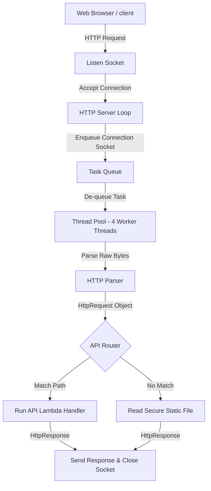

# High-Performance Multithreaded C++ HTTP Server
### *Custom Winsock2-based Web Engine from Scratch*

This repository contains a low-level, high-performance HTTP/1.1 web server built from scratch in **C++20** using the native Windows Sockets API (**Winsock2**). 

It is designed to demonstrate core systems engineering concepts: multithreading, concurrent task scheduling via a thread pool, socket programming, byte-level parsing, and secure filesystem access.

---

## 🛠️ Architecture & Core Features



### Key Technical Implementations
1. **Multithreaded Task Queue (Thread Pool):** Implements a standard concurrency design with a task queue using `std::mutex` and `std::condition_variable` to orchestrate 4 worker threads running requests in parallel.
2. **HTTP/1.1 Parser:** Custom, zero-dependency parser that reads raw stream bytes into headers, extracts URL-decoded query parameters, and extracts POST bodies using `Content-Length`.
3. **MIME-Type Resolver:** Standard lookup for file extensions (`.html`, `.css`, `.js`, `.json`, `.png`, etc.) to serve modern UI files with accurate headers.
4. **Path Traversal Protection (Security):** Resolves base directories to absolute canonical paths using C++17 `<filesystem>` and enforces strict prefix checks to prevent path traversal vulnerability attacks (e.g., `GET /../../windows`).
5. **Dynamic API Routing:** Simple endpoint matching system allowing developers to register routing lambdas with path matching and query parsing support.

---

## 📂 Project Structure

```
cpp-http-server/
├── include/
│   ├── ThreadPool.hpp     # Safe task queue execution thread pool
│   ├── HttpRequest.hpp    # Request parsing struct
│   ├── HttpResponse.hpp   # Response builder helper
│   ├── HttpParser.hpp     # HTTP protocol parser and URL decoder
│   ├── MimeTypes.hpp      # Header content-type mapper
│   └── HttpServer.hpp     # Server event loop and router declarations
├── src/
│   ├── HttpServer.cpp     # Winsock socket lifecycle and file server
│   └── main.cpp           # Route declarations & signal handler setup
├── public/
│   └── index.html         # Rich dashboard served to test the API endpoints
├── build.ps1              # Easy PowerShell compilation script
└── README.md              # Technical specifications
```

---

## ⚡ API Specification

### 1. Serve Static Dashboard
* **URL:** `/` or `/index.html`
* **Method:** `GET`
* **Response:** Serving the custom-built web application dashboard.

### 2. Get Server Status
* **URL:** `/api/status`
* **Method:** `GET`
* **Response (200 OK):**
  ```json
  {
    "status": "healthy",
    "uptime_seconds": 12.45,
    "thread_pool_workers": 4,
    "version": "1.0.0",
    "engine": "Antigravity C++ Engine"
  }
  ```

### 3. Personalised Greeting
* **URL:** `/api/greet?name=Raghav`
* **Method:** `GET`
* **Response (200 OK):**
  ```json
  {
    "message": "Hello, Raghav! Welcome to the C++ Web Server.",
    "query_param_received": "Raghav"
  }
  ```

### 4. POST Body Echo
* **URL:** `/api/echo`
* **Method:** `POST`
* **Body:** Raw text or JSON payload.
* **Response (200 OK):** Mirrors back the request body.

---

## 🚀 Compilation & Running

### Prerequisites
* **GCC / G++ Compiler** supporting C++20 standard library threads and filesystem features.

### Compile
Run the compilation script in a PowerShell window:
```powershell
.\build.ps1
```
*Note: This runs the compiler command under the hood:*
`g++ -std=c++20 -O3 -Wall src/main.cpp src/HttpServer.cpp -o server.exe -lws2_32`

### Run
Launch the server executable (port argument is optional, defaults to 8080):
```powershell
.\server.exe 8080
```

Open your browser and navigate to:
👉 **[http://localhost:8080](http://localhost:8080)**
