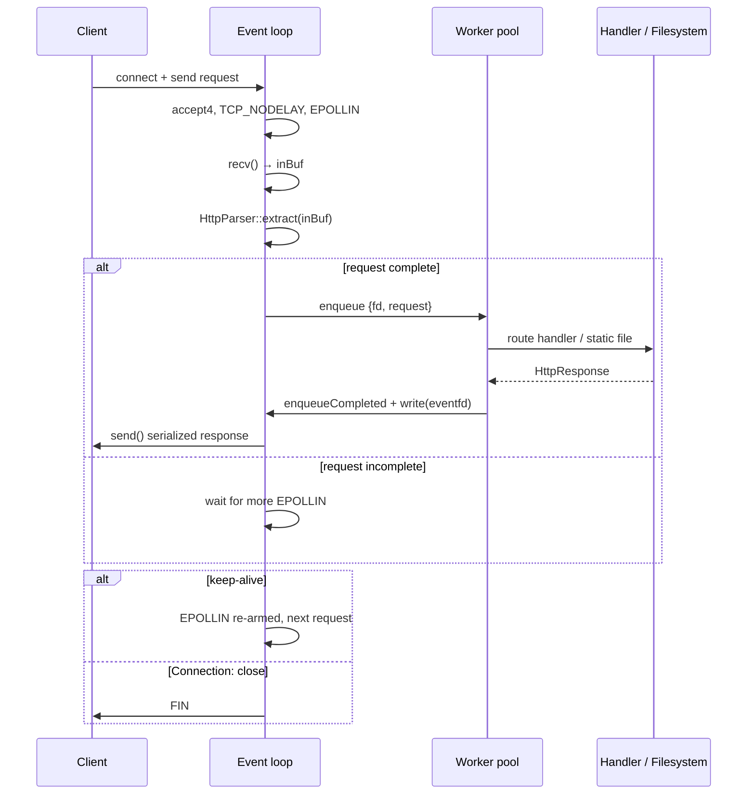

# ⚡ Nexus HTTP Server

> A dependency-free HTTP/1.1 web server in C++20, built directly on Linux
> kernel primitives: `epoll`, `eventfd`, and non-blocking POSIX sockets.
> Zero libraries. Zero abstractions. Just syscalls.

---

## 📑 Table of Contents

- [Tech Stack](#-tech-stack)
- [What It Does](#-what-it-does)
- [Why: Design Goals](#-why-design-goals)
- [Architecture](#-architecture)
- [How: Implementation](#-how-implementation)
- [Build](#-build)
- [Run](#-run)
- [API Reference](#-api-reference)
- [Project Layout](#-project-layout)
- [Limitations / Future Work](#-limitations--future-work)

---

## 🧰 Tech Stack

| Layer | Choice | Why it matters |
| --- | --- | --- |
| **Language** | C++20 | Native speed, RAII for cleanup, and `std::string` / `std::filesystem` so there's no need for third-party libraries |
| **Event loop** | `epoll` (level-triggered) | The Linux way to watch thousands of sockets from one thread and only act when a socket actually has data |
| **Sockets** | Non-blocking `accept4` / `recv` / `send` | Calls never block; if there's nothing to read the call returns immediately and the loop moves on |
| **Wakeup channel** | `eventfd` | A thread-safe "nudge" so worker threads can tell the event loop *a response is ready* without touching socket internals |
| **Concurrency** | Worker pool of 4 threads (`std::thread` + condition variable) | Slow work (parsing, disk reads) happens off the event loop so one slow request never stalls everyone else |
| **Static serving** | `std::filesystem` + `ifstream` | Canonical path resolution for traversal safety; MIME type lookup by file extension |
| **Build** | Makefile / CMake / Docker | It compiles with a single `g++` command; the only thing linked beyond the standard library is `pthread` |

**In simple terms:** the day-to-day plumbing of this project is just the
Linux kernel (`epoll`, sockets) plus the C++ standard library. Nothing else.
It's a good way to see what "high performance" actually means at the
systems level, because everything is right here in plain sight.

---

## 📌 What It Does

Nexus is a working HTTP/1.1 web server. Concretely, each step of the
request lifecycle is handled from scratch:

1. **Listens** on a configurable port and accepts incoming connections.
2. **Reads** request bytes off the socket as they arrive.
3. **Parses** the request into usable pieces: method, path, query string,
   headers, and body.
4. **Routes** the parsed request — either to a C++ handler you registered,
   or to a static file in `public/`.
5. **Serializes** a proper HTTP response with `Content-Length`, `Date`, and
   `Server` headers.
6. **Writes** the response back, then keeps the connection open for the
   next request (keep-alive).

It also tolerates the messy parts of the real world: bare `\n` line
endings, pipelined requests queued on one connection, oversized bodies
(`413`), `HEAD` requests, and path traversal attempts (`403`).

---

## 🎯 Why: Design Goals

These three goals drove every decision in the code:

| Goal | Consequence |
| --- | --- |
| **Serve many connections with few threads** | A single event-loop thread owns *all* I/O. Nobody spawns a thread per connection, because an idle keep-alive client would waste a whole thread (and its 8 MB stack) just waiting. |
| **Never block the loop on slow work** | Parsing, routing, and file I/O run on a bounded worker pool. The loop only does fast things: `recv`, `send`, and bookkeeping. |
| **Stay dependency-free and readable** | Every line is system-level code you can step through in a debugger. No framework hides what's happening. |

**In simple terms:** the classic beginner server answers one visitor at a
time. That's fine until one visitor stalls and everyone behind them waits.
Nexus splits the job — one person watching all the doors, a few people
doing the actual fetching — so nobody waits on anyone else.

---

## 🏗️ Architecture

Nexus is organized into two halves that talk to each other through a task queue.

- **The I/O plane (1 thread):** the *event loop*. It watches every open
  socket with `epoll_wait`. When a socket is readable it reads the bytes;
  when a full request is assembled it sends that request to a worker.
  When a worker delivers a finished response, the loop writes it out.
- **The compute plane (4 worker threads):** the *doers*. They parse the
  request, resolve the route or open the file, produce the `HttpResponse`,
  serialize it to a string, and hand it back.

```
                  ┌─────────────────────────────────────────────┐
   connections ──►│           I/O PLANE (1 thread)              │
    epoll_wait    │  accept4 ─► recv ─► extract() ─► dispatch   │
                  │                    │              │         │
                  │                    │    complete request     │
                  │                    ▼              │         │
                  │              task queue ◄─────────┤         │
                  └───────────────────┬───────────────┘─────────┘
                                      │ enqueue
                                      ▼
   ┌─────────────────────────────────────────────────────────────┐
   │              COMPUTE PLANE (worker pool, N=4)               │
   │  parse(req) ─► route / serveStatic ─► serialize response     │
   └──────────────┬──────────────────────────────────────────────┘
                  │ eventfd write(1) ──► wakeup
                  ▼
   ┌─────────────────────────────────────────────────────────────┐
   │  drainCompleted ─► set EPOLLOUT ─► send(outBuf) ─► re-arm    │
   └─────────────────────────────────────────────────────────────┘
```

### The three key ideas, explained simply

**`epoll` — watching many doors at once.**
Normally reading a socket is one-at-a-time: you ask, you wait, you get.
`epoll` flips it around — you say "tell me when any of these sockets has
something for me," and the kernel answers with only the sockets that are
ready. One thread can then service thousands of connections. That single
`recv`-only-once-ready property is why the server stays snappy under load.

**`eventfd` — the "ping" between workers and the loop.**
Workers live on their own threads. To hand a completed response back they
can't just poke the loop's data structures safely. Instead they increment
a tiny kernel counter (`write(eventfd, 1)`), which wakes `epoll_wait`. The
loop then drains whatever responses have piled up. Simple, atomic, and
deadlock-free.

**The worker pool — bounded parallelism.**
Parsing, route lookup, and file reads are CPU/disk work. Doing that on the
loop thread would stop new `recv`s from happening. Instead, complete
requests are queued and a fixed set of 4 workers consumes them. Bounded
pool = bounded memory, no thread explosion, and the loop never blocks.

### Request lifecycle (sequence diagram)



### Per-connection state

Every accepted socket carries a small state struct (`include/Connection.hpp`):

| Field | Role |
| --- | --- |
| `inBuf` | Bytes received but not yet parsed into a request |
| `outBuf` / `outOffset` | The serialized response, and how much has been sent so far |
| `keepAlive` | Whether to watch for a next request after this response flushes |
| `taskInFlight` | True while a worker is busy with this connection — stops two requests being dispatched at once |
| `peerClosed` | The client sent FIN; deliver the response, then close |
| `abandoned` | The connection died while a task was in flight — defer `close()` until the response is drained |

**Why `taskInFlight` exists:** an fd must never be closed while a worker is
still using it. If a client disconnects mid-request and the loop closed
that fd (and `accept4` handed the *same number*) to a brand-new connection,
the worker's finished response would be written into someone else's stream.
`taskInFlight` + `abandoned` make the close wait until the dust settles.

---

## ⚙️ How: Implementation

Each step below shows the core idea, the actual code, and what it achieves.

### 1. The listener — one non-blocking socket

The socket is created non-blocking and close-on-exec, with `SO_REUSEADDR`
so a quick restart doesn't fail with `Address already in use`:

```cpp
listenSocket = socket(AF_INET, SOCK_STREAM | SOCK_NONBLOCK | SOCK_CLOEXEC, IPPROTO_TCP);
setsockopt(listenSocket, SOL_SOCKET, SO_REUSEADDR, &opt, sizeof(opt));
bind(listenSocket, ...);
listen(listenSocket, SOMAXCONN);
epoll_ctl(epollFd, EPOLL_CTL_ADD, listenSocket, &ev);   // watch for EPOLLIN
```

**What it achieves:** one descriptor represents "the front door"; the
kernel tells us when a visitor has arrived, and `acceptConnections()` loops
on `accept4` until `EAGAIN`, grabbing everyone waiting.

### 2. The event loop — react to what's ready

`epoll_wait` returns only the descriptors that need attention:

```cpp
int n = epoll_wait(epollFd, events.data(), events.size(), -1);
for (auto& e : events) {
    if (e.data.fd == listenSocket)   acceptConnections();
    else if (e.data.fd == eventFd)   drainCompleted();
    else                             read/write the connection;
}
```

There are exactly three sources of events, and everything else in the
program is completely idle until the kernel reports them. This is the
heart of "one thread, many connections."

### 3. Incremental parsing — headers first, body only when complete

The parser first locates the header terminator, then decides how big the
body must be. Important consequences: incomplete requests (no body yet)
return `{false, 0}` and the loop just keeps reading; an over-sized declared
body is refused immediately with a 413 *before* megabytes are buffered.

```cpp
size_t headerEnd = buf.find("\r\n\r\n");            // bare "\n\n" also works
if (headerEnd == npos) return {false, 0};           // not enough data yet
size_t bodyLen = stoull(contentLength);
if (bodyLen > maxBody) return {true, ...};          // caller answers 413
if (used + bodyLen > buf.size()) return {false, 0}; // body has not arrived
```

### 4. Dispatch to the worker pool — hand off, don't block

When a request is complete the loop erases its bytes, marks the connection
busy, and hands the work to the pool. The worker runs the handler, then
wakes the loop through the `eventfd`:

```cpp
conn.inBuf.erase(0, used);
conn.taskInFlight = true;
threadPool.enqueue([this, fd, keepAlive, req = std::move(req)]() {
    HttpResponse res = handleRequest(req);
    res.headers["Connection"] = keepAlive ? "keep-alive" : "close";
    enqueueCompleted(fd, res.toString());            // write(eventfd)
});
```

The lambda captures the connection's fd and the parsed request by value —
the loop is free to keep serving other connections while the worker works.

### 5. Static files — served safely

The requested path is canonicalized and verified to resolve strictly
inside the static root. Paths that climb out with `..` resolve to `..`
components and are refused with a 403:

```cpp
fs::path targetPath = fs::canonical(baseDir / relPath.substr(1));
for (auto& c : fs::relative(targetPath, baseDir))
    if (c == "..") return errorResponse(403, "Forbidden", ...);
```

The response's `Content-Type` is inferred from the file extension via
`MimeTypes::getType`, and binary files are read without corruption
(`std::ios::binary`).

### 6. Example routes — how to add an API

Routes are matched exactly on method + path and call a handler that maps a
`HttpRequest` to an `HttpResponse`:

```cpp
server->route("GET", "/api/greet", [](const HttpRequest& req) {
    HttpResponse res;
    res.headers["Content-Type"] = "application/json";

    std::string name = req.queryParams.count("name") ? req.queryParams.at("name")
                                                     : "Guest";
    res.body = R"({"message": "Hello, )" + jsonEscape(name) + R"(..."})";
    return res;
});
```

`jsonEscape` guarantees user input is data, not markup: a query value of
`<script>alert(1)</script>` is JSON-escaped before being placed in the
response body, so it can never execute in a browser.

---

## 🛠️ Build

Requires **Linux**, a C++20 compiler (GCC ≥ 11 / Clang ≥ 14), and `make`
or CMake ≥ 3.16.

```bash
# Makefile
make                          # → ./nexus-server

# or CMake
cmake -B build -S .
cmake --build build -j
```

Under the hood it's a single compilation — no packages to install:

```bash
g++ -std=c++20 -O3 -Wall -Wextra -Iinclude src/main.cpp src/HttpServer.cpp -o nexus-server
```

---

## ▶️ Run

```bash
./nexus-server [port]     # port defaults to 8080
```

| Signal | Behavior |
| --- | --- |
| `SIGINT` / `SIGTERM` | A `write(eventfd)` wakes the loop → the loop drains in-flight work, closes every fd, shuts the workers down, exits 0 |

Then open <http://localhost:8080>. The served dashboard includes a live
latency benchmark button (100 requests to `/api/status`) and an API
playground for the endpoints below — a good way to watch the server work.

---

## 📡 API Reference

| Endpoint | Method | Description |
| --- | --- | --- |
| `/` | `GET` / `HEAD` | Static dashboard (HTML/CSS/JS) |
| `/api/status` | `GET` | Health, uptime, worker count, version |
| `/api/greet?name=<x>` | `GET` | JSON greeting with escaped query param |
| `/api/echo` | `POST` | Returns the request body |

```bash
curl localhost:8080/api/status
# → {"status":"healthy","uptime_seconds":12.4,"thread_pool_workers":4,"version":"1.0.0"}

curl 'localhost:8080/api/greet?name=Alex'
# → {"message":"Hello, Alex! Welcome to the C++ Web Server.","query_param_received":"Alex"}

curl -X POST -d '{"key":"value"}' localhost:8080/api/echo
# → {"key":"value"}
```

Anything that isn't a registered route falls through to the static root
(`public/`): a missing file is a `404`, a path that escapes the root is a
`403`, and a `POST` with no matching route is a `404`.

---

## 📁 Project Layout

```
├── include/
│   ├── Connection.hpp      # per-connection state (buffers, keep-alive, in-flight guard)
│   ├── HttpParser.hpp      # incremental parser + URL decoding
│   ├── HttpRequest.hpp     # request model (method/path/headers/body/query)
│   ├── HttpResponse.hpp    # response serialization (Content-Length / Date / Server)
│   ├── HttpServer.hpp      # event loop + routing declarations
│   ├── MimeTypes.hpp       # extension → Content-Type map
│   └── ThreadPool.hpp      # bounded worker pool
├── src/
│   ├── HttpServer.cpp      # sockets, epoll, dispatch, static files, errors
│   └── main.cpp            # wiring, routes, signals, JSON escaping
├── public/                 # static web root (the dashboard)
├── CMakeLists.txt          # CMake build
├── Dockerfile              # multi-stage container build
├── Makefile                # make / make run / make clean
└── nexus-server            # compiled binary
```

---

## ⏭️ Limitations / Future Work

Honest assessment of what this project isn't yet:

- **No idle timeouts** — a perfectly still keep-alive client holds an fd
  (and its slot in the connection table) forever.
- **No TLS / HTTP/2** — traffic is plain HTTP/1.1; HTTPS belongs to a
  reverse proxy in front of it.
- **Whole files are buffered** — a large static file is read fully into
  memory rather than streamed with `sendfile`.
- **No config file** — port, workers, routes, and static root are baked
  into `src/main.cpp`.
- **No automated tests** — the parser edge cases (bare `\n`, chunked,
  giant `Content-Length`) would benefit from a test suite.

---

*Nexus HTTP Server — C++20, Linux epoll, zero dependencies.*