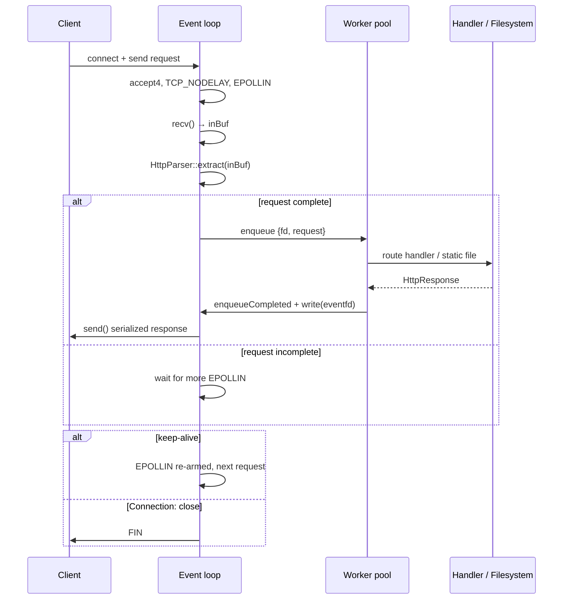

# ⚡ Nexus HTTP Server

> A dependency-free HTTP/1.1 web server in C++20, built directly on Linux
> kernel primitives: `epoll`, `eventfd`, and non-blocking POSIX sockets.
> Zero libraries. Zero abstractions. Just syscalls.

---

## 📑 Table of Contents

- [Tech Stack](#-tech-stack)
- [What It Does](#-what-it-does)
- [Why: Design Goals](#-why-design-goals)
- [Architecture](#-architecture)
- [How: Implementation](#-how-implementation)
- [Build](#-build)
- [Run](#-run)
- [API Reference](#-api-reference)
- [Project Layout](#-project-layout)
- [Limitations / Future Work](#-limitations--future-work)

---

## 🧰 Tech Stack

| Layer | Choice | Why |
| --- | --- | --- |
| **Language** | C++20 | RAII for resource cleanup, `std::string`/`std::filesystem` built in, no GC latency spikes |
| **Event loop** | `epoll` (level-triggered) | Multiplexes thousands of idle sockets in a single thread — the Linux standard for this |
| **Sockets** | Non-blocking `accept4` / `recv` / `send` | No thread parked per connection; one loop thread handles all readiness |
| **Wakeup channel** | `eventfd` | Worker → loop notifications without touching socket state off-thread, no signal races |
| **Concurrency** | Bounded worker pool (default 4, `std::thread` + condition variable) | CPU/disk work happens off the event loop so I/O never stalls behind parsing or file reads |
| **Static serving** | `std::filesystem` + `ifstream` | Path canonicalization for traversal safety; MIME mapping by extension |
| **Build** | Makefile / CMake / Docker | Zero deps — compiles with plain `g++`, no linking beyond `pthread` |

Everything above is part of the Linux kernel or the C++ standard library.
There are no third-party libraries anywhere in the project.

---

## 📌 What It Does

Nexus is a working HTTP/1.1 web server that:

- **Listens** on a configurable port and accepts connections with `accept4`
- **Parses** requests incrementally (headers first, then body)
- **Routes** requests to registered handlers, or **serves static files** from `public/`
- **Responds** with fully serialized HTTP responses (`Content-Length`, `Date`, `Server` headers)
- **Keeps connections alive** across requests (HTTP/1.1 keep-alive by default)
- **Handles multiple requests per connection** (pipelining) sequentially
- **Shuts down cleanly** on `SIGINT` / `SIGTERM` through an `eventfd` wakeup

---

## 🎯 Why: Design Goals

The three decisions that shaped everything else:

| Goal | Consequence |
| --- | --- |
| **Handle many connections with few threads** | A single-threaded event loop owns all I/O. No `thread-per-connection` — that would waste a thread (and its stack) on every idle keep-alive socket. |
| **Never block the loop on slow work** | Parsing, routing, and file I/O are pushed to a worker pool. The loop only does `recv`/`send` and state tracking. |
| **Keep it dependency-free and readable** | Every line is system code — you can step through the whole request lifecycle in a debugger without third-party code. |

---

## 🏗️ Architecture

Nexus splits the work into two planes:

- **The I/O plane (1 thread):** the event loop. It watches all file
  descriptors with `epoll_wait`, reads request bytes, dispatches complete
  requests to workers, and flushes finished responses back to clients.
- **The compute plane (N workers):** it parses the full request, resolves
  the route, reads from disk (or runs the handler), serializes the response,
  and hands it back through an `eventfd` wakeup.

```
                  ┌─────────────────────────────────────────────┐
   connections ──►│           I/O PLANE (1 thread)              │
    epoll_wait    │  accept4 ─► recv ─► extract() ─► dispatch   │
                  │                    │              │         │
                  │                    │    complete request     │
                  │                    ▼              │         │
                  │              task queue ◄─────────┤         │
                  └───────────────────┬───────────────┘─────────┘
                                      │ enqueue
                                      ▼
   ┌─────────────────────────────────────────────────────────────┐
   │              COMPUTE PLANE (worker pool, N=4)               │
   │  parse(req) ─► route / serveStatic ─► serialize response     │
   └──────────────┬──────────────────────────────────────────────┘
                  │ eventfd write(1) ──► wakeup
                  ▼
   ┌─────────────────────────────────────────────────────────────┐
   │  drainCompleted ─► set EPOLLOUT ─► send(outBuf) ─► re-arm    │
   └─────────────────────────────────────────────────────────────┘
```

### Request lifecycle (sequence diagram)



### Per-connection state

Every accepted socket carries a small struct (`include/Connection.hpp`):

| Field | Role |
| --- | --- |
| `inBuf` | Accumulated bytes not yet parsed |
| `outBuf` / `outOffset` | Serialized response pending `send()` |
| `keepAlive` | Whether to re-arm `EPOLLIN` after flushing |
| `taskInFlight` | True while a worker owns this connection — prevents double-dispatch |
| `peerClosed` | FIN received; deliver the response, then close |
| `abandoned` | Peer unreachable while a task is in flight — defer `close()` until drained |

> **Why `taskInFlight` matters:** the fd is never closed while a task is in
> flight. If a peer disconnects mid-request and the fd were closed and
> reused by `accept4`, the worker's finished response would be written to
> the wrong connection. The `abandoned` flag defers `close()` until the
> worker's response has been drained.

---

## ⚙️ How: Implementation

Each step below shows the core idea and the actual code that implements it.

### 1. Non-blocking listener

The listening socket is non-blocking and close-on-exec, plus `SO_REUSEADDR`
so restarts don't hit `Address already in use`:

```cpp
listenSocket = socket(AF_INET, SOCK_STREAM | SOCK_NONBLOCK | SOCK_CLOEXEC, IPPROTO_TCP);
setsockopt(listenSocket, SOL_SOCKET, SO_REUSEADDR, &opt, sizeof(opt));
bind(listenSocket, ...);
listen(listenSocket, SOMAXCONN);
epoll_ctl(epollFd, EPOLL_CTL_ADD, listenSocket, &ev);   // EPOLLIN
```

### 2. The event loop

`epoll_wait` returns whatever is ready. Three kinds of fd can appear:
the listener (accept), the `eventfd` (worker handoff), or a connection
(read/write). Everything else in the program idles for free:

```cpp
int n = epoll_wait(epollFd, events.data(), events.size(), -1);
for (auto& e : events) {
    if (e.data.fd == listenSocket)   acceptConnections();
    else if (e.data.fd == eventFd)   drainCompleted();
    else                             read/write the connection;
}
```

### 3. Incremental parsing (headers before body)

The parser finds the header terminator first, then decides how large the
body is. **Nothing is buffered until the body is known to be complete** —
and oversized declared bodies (over 8 MB) are rejected without being read.

```cpp
size_t headerEnd = buf.find("\r\n\r\n");            // or "\n\n"
if (headerEnd == npos) return {false, 0};           // incomplete, wait for more
size_t bodyLen = stoull(contentLength);
if (bodyLen > maxBody) return {true, ...};          // caller answers 413
if (used + bodyLen > buf.size()) return {false, 0}; // body not here yet
```

### 4. Dispatch to the worker pool

The loop erases the consumed bytes, marks the connection busy, and enqueues
a task. The worker runs the handler on its own thread, then wakes the loop
through `eventfd`:

```cpp
conn.inBuf.erase(0, used);
conn.taskInFlight = true;
threadPool.enqueue([this, fd, keepAlive, req = std::move(req)]() {
    HttpResponse res = handleRequest(req);
    res.headers["Connection"] = keepAlive ? "keep-alive" : "close";
    enqueueCompleted(fd, res.toString());            // write(eventfd)
});
```

### 5. Static file serving with path safety

The requested path is resolved with `fs::canonical` and verified — via
`fs::relative` — to stay strictly inside the static root. A `../`
escaping a path resolves to `..` components and earns a `403`:

```cpp
fs::path targetPath = fs::canonical(baseDir / relPath.substr(1));
for (auto& c : fs::relative(targetPath, baseDir))
    if (c == "..") return errorResponse(403, "Forbidden", ...);
```

### 6. Example routes (`src/main.cpp`)

Routes are registered with a method + path and a handler function. The
handler receives the parsed request and returns a response:

```cpp
server->route("GET", "/api/greet", [](const HttpRequest& req) {
    HttpResponse res;
    res.headers["Content-Type"] = "application/json";

    std::string name = req.queryParams.find("name") != req.queryParams.end()
                     ? req.queryParams["name"] : "Guest";
    res.body = R"({"message": "Hello, )" + jsonEscape(name) + R"(! Welcome to the C++ Web Server."})";
    return res;
});
```

`jsonEscape` runs user input through an escaper, so a query value like
`<script>alert(1)</script>` is returned as *data*, never as live HTML.

---

## 🛠️ Build

Requires **Linux**, a C++20 compiler (GCC ≥ 11 / Clang ≥ 14), and `make`
or CMake ≥ 3.16.

```bash
# Makefile
make                          # → ./nexus-server

# or CMake
cmake -B build -S .
cmake --build build -j
```

Compilation is a single `g++` invocation — nothing to install:

```bash
g++ -std=c++20 -O3 -Wall -Wextra -Iinclude src/main.cpp src/HttpServer.cpp -o nexus-server
```

---

## ▶️ Run

```bash
./nexus-server [port]     # port defaults to 8080
```

| Signal | Behavior |
| --- | --- |
| `SIGINT` / `SIGTERM` | `write(eventfd)` wakes the loop → loop drains, closes fds, shuts down workers → exit 0 |

Then open <http://localhost:8080> — the dashboard ships a live latency
benchmark button and an API playground for the endpoints below.

---

## 📡 API Reference

| Endpoint | Method | Description |
| --- | --- | --- |
| `/` | `GET` / `HEAD` | Static dashboard (HTML/CSS/JS) |
| `/api/status` | `GET` | Health, uptime, worker count, version |
| `/api/greet?name=<x>` | `GET` | JSON greeting with escaped query param |
| `/api/echo` | `POST` | Returns the request body |

```bash
curl localhost:8080/api/status
# → {"status":"healthy","uptime_seconds":12.4,"thread_pool_workers":4,"version":"1.0.0"}

curl 'localhost:8080/api/greet?name=Alex'
# → {"message":"Hello, Alex! Welcome to the C++ Web Server.","query_param_received":"Alex"}

curl -X POST -d '{"key":"value"}' localhost:8080/api/echo
# → {"key":"value"}
```

Unmatched paths fall through to the static root (`public/`); a missing file
returns `404`, and a path that cannot be canonicalized inside the root
returns `403`.

---

## 📁 Project Layout

```
├── include/
│   ├── Connection.hpp      # per-connection state machine
│   ├── HttpParser.hpp      # incremental parser + URL decoding
│   ├── HttpRequest.hpp     # request model (method/path/headers/body/query)
│   ├── HttpResponse.hpp    # serialization (Content-Length / Date / Server)
│   ├── HttpServer.hpp      # event loop + routing declarations
│   ├── MimeTypes.hpp       # extension → Content-Type map
│   └── ThreadPool.hpp      # bounded worker pool
├── src/
│   ├── HttpServer.cpp      # sockets, epoll, dispatch, static files, errors
│   └── main.cpp            # wiring, routes, signals, JSON escaping
├── public/                 # static web root (dashboard)
├── CMakeLists.txt          # CMake build
├── Dockerfile              # multi-stage container build
├── Makefile                # make / make run / make clean
└── nexus-server            # compiled binary
```

---

## ⏭️ Limitations / Future Work

- **No idle timeouts** — a silent keep-alive client holds an fd indefinitely.
- **No TLS / HTTP/2** — delegate HTTPS to a reverse proxy when exposed publicly.
- **Whole files buffered on read** — large static files load fully into memory.
- **No config file** — port, workers, routes, and static root live in `src/main.cpp`.
- **No automated tests yet** — the request/parser edge cases are worth a test suite.

---

*Nexus HTTP Server — C++20, Linux epoll, zero dependencies.*